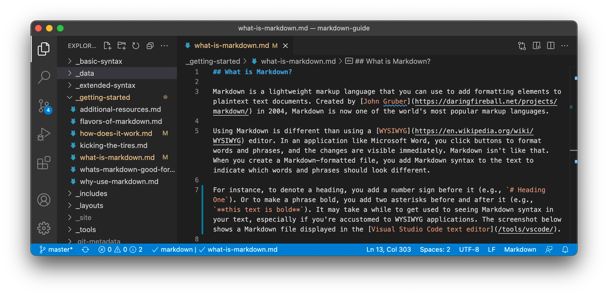
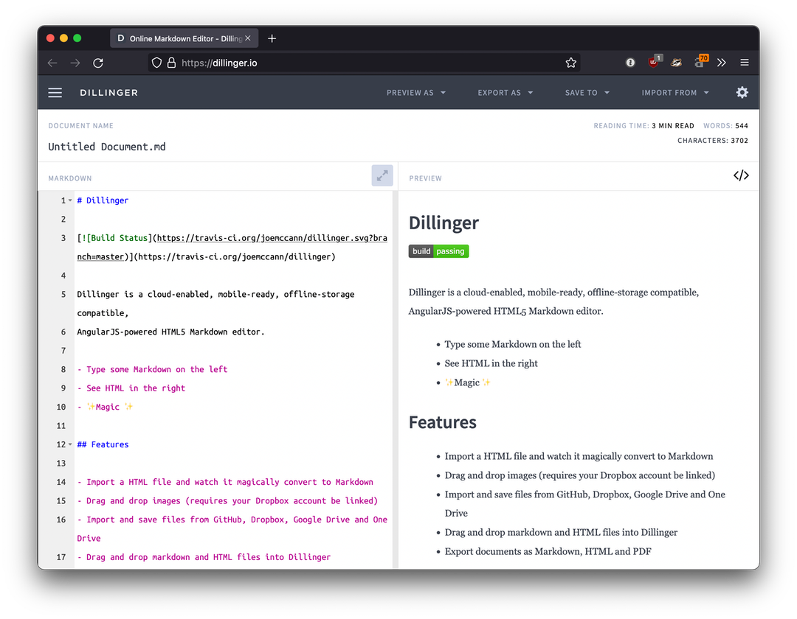

# Introduction to markdown 

## What is Markdown?

This document is referred from [here](https://www.markdownguide.org/getting-started/#what-is-markdown)

* Markdown is a lightweight markup language that you can use to add formatting elements to plaintext text documents.
* Created by John Gruber in 2004, Markdown is now one of the world’s most popular markup languages.
* Using Markdown is different than using a WYSIWYG editor. 
* In an application like Microsoft Word, you click buttons to format words and phrases, and the changes are visible immediately.
* Markdown isn’t like that. When you create a Markdown-formatted file, you add Markdown syntax to the text to indicate which words and phrases should look different.

     For example, to denote a heading, you add a number sign before it (e.g., # Heading One). 
Or to make a phrase bold, you add two asterisks before and after it (e.g., **this text is bold**).
It may take a while to get used to seeing Markdown syntax in your text, especially if you’re accustomed to WYSIWYG applications. 
The screenshot below shows a Markdown file displayed in the Visual Studio Code text editor.
  

You can add Markdown formatting elements to a plaintext file using a text editor application. 
Or you can use one of the many Markdown applications for macOS, Windows, Linux, iOS, and Android operating systems.
There are also several web-based applications specifically designed for writing in Markdown.

## Why Use Markdown? 

This document is referred from [here](https://www.markdownguide.org/getting-started/#why-use-markdown)

You might be wondering why people use Markdown instead of a WYSIWYG editor.
Why write with Markdown when you can press buttons in an interface to format your text? 
As it turns out, there are a couple different reasons why people use Markdown instead of WYSIWYG editors.

* **Markdown can be used for everything.** People use it to create websites, documents, notes, books, presentations, email messages, and technical documentation.

* **Markdown is portable.** Files containing Markdown-formatted text can be opened using virtually any application. If you decide you don’t like the Markdown application you’re currently using, you can import your Markdown files into another Markdown application. That’s in stark contrast to word processing applications like Microsoft Word that lock your content into a proprietary file format.

* **Markdown is platform independent.** You can create Markdown-formatted text on any device running any operating system.

* **Markdown is future proof.** Even if the application you’re using stops working at some point in the future, you’ll still be able to read your Markdown-formatted text using a text editing application. This is an important consideration when it comes to books, university theses, and other milestone documents that need to be preserved indefinitely.

* **Markdown is everywhere.** Websites like Reddit and GitHub support Markdown, and lots of desktop and web-based applications support it.

## Kicking the Tires 

This document is referred from [here](https://www.markdownguide.org/getting-started/#kicking-the-tires)

* The best way to get started with Markdown is to use it. That’s easier than ever before thanks to a variety of free tools.
* You don’t even need to download anything. 
  There are several online Markdown editors that you can use to try writing in Markdown.
* [Dillinger](https://dillinger.io/) is one of the best online Markdown editors. Just open the site and start typing in the left pane.
* A preview of the rendered document appears in the right pane.

  
## How Does it Work?

This document is referred from [here](https://www.markdownguide.org/getting-started/#how-does-it-work)

* Dillinger makes writing in Markdown easy because it hides the stuff happening behind the scenes, 
  but it’s worth exploring how the process works in general.

* When you write in Markdown, the text is stored in a plaintext file that has an .md or .markdown extension. 
  But then what? How is your Markdown-formatted file converted into HTML or a print-ready document?

* The short answer is that you need a Markdown application capable of processing the Markdown file. 
  There are lots of applications available — everything from simple scripts to desktop applications that look like Microsoft Word. 
  Despite their visual differences, all of the applications do the same thing. 
  Like Dillinger, they all convert Markdown-formatted text to HTML so it can be displayed in web browsers.

* Markdown applications use something called a Markdown processor (also commonly referred to as a “parser” or an “implementation”) to take the Markdown-formatted text and output it to HTML format. 
  At that point, your document can be viewed in a web browser or combined with a style sheet and printed. You can see a visual representation of this process below.
  
>  Note: The Markdown application and processor are two separate components. For the sake of brevity, I've combined them into one element ("Markdown app") in the figure below.

To summarize, this is a four-part process:
  1. Create a Markdown file using a text editor or a dedicated Markdown application. The file should have an .md or .markdown extension.
  1. Open the Markdown file in a Markdown application.
  1. Use the Markdown application to convert the Markdown file to an HTML document.
  1. View the HTML file in a web browser or use the Markdown application to convert it to another file format, like PDF.

From your perspective, the process will vary somewhat depending on the application you use. 
For example, Dillinger essentially combines steps 1-3 into a single, seamless interface — all you have to do is type in the left pane and the rendered output magically appears in the right pane. 
But if you use other tools, like a text editor with a static website generator, you’ll find that the process is much more visible.

## What’s Markdown Good For?

This document is referred from [here](https://www.markdownguide.org/getting-started/#whats-markdown-good-for).

* Markdown is a fast and easy way to take notes, create content for a website, and produce print-ready documents.
* It doesn’t take long to learn the Markdown syntax, and once you know how to use it, you can write using Markdown just about everywhere. 
* Most people use Markdown to create content for the web, but Markdown is good for formatting everything from email messages to grocery lists.

## Additional Resources

There are lots of resources you can use to learn Markdown. 
Here are some other introductory resources:

* **[John Gruber’s Markdown documentation](https://daringfireball.net/projects/markdown/)**.
  The original guide written by the creator of Markdown.
* **[Markdown Tutorial](https://www.markdowntutorial.com/)**.
  An open source website that allows you to try Markdown in your web browser.
* **[Awesome Markdown](https://github.com/mundimark/awesome-markdown)**.
  A list of Markdown tools and learning resources.
* **[Typesetting Markdown](https://dave.autonoma.ca/blog/2019/05/22/typesetting-markdown-part-1)**.
  A multi-part series that describes an ecosystem for typesetting Markdown documents using pandoc and ConTeXt.

# References

1. [www.markdownguide.org](https://www.markdownguide.org/getting-started/)
2. [docs.github.com](https://docs.github.com/en/github/writing-on-github/getting-started-with-writing-and-formatting-on-github/basic-writing-and-formatting-syntax)