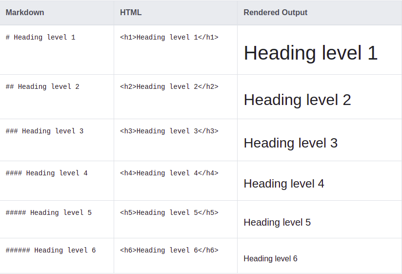
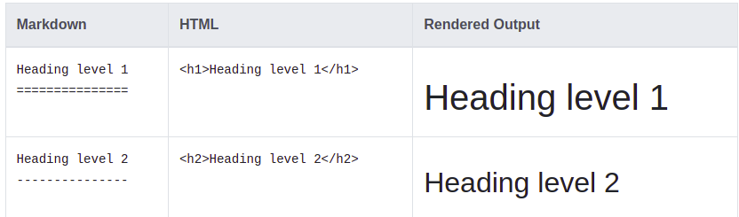
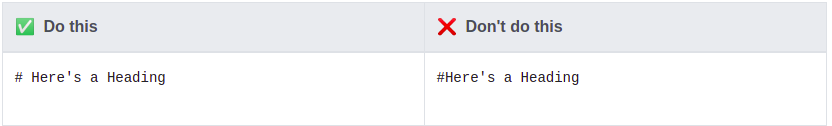
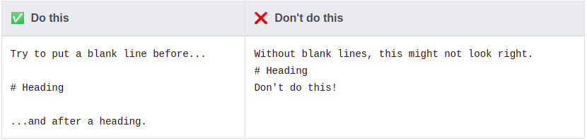

# Headings 

To create a heading, add number signs (#) in front of a word or phrase.
Thenumber of number signs you use should correspond to the heading level. 
For example, to create a heading level three (<h 3>), use three number signs (e.g., ### My Header).

## Headings used in Markdown
* The steps are followed from [here](https://www.markdownguide.org/basic-syntax/#headings).

## Alternate Syntax
* The steps are followed from [here](https://www.markdownguide.org/basic-syntax/#alternate-syntax).
* Alternatively, on the line below the text, add any number of == characters for heading level 1 or -- characters for heading level 2.

## Heading Best Practices

* Markdown applications don’t agree on how to handle a missing space between the number signs (#) and the heading name. 
  For compatibility, always put a space between the number signs and the heading name.

  

* You should also put blank lines before and after a heading for compatibility.

  
# References

1. [www.markdownguide.org](https://www.markdownguide.org/basic-syntax/)