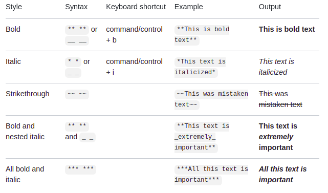
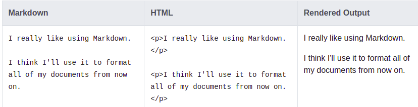
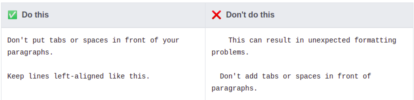
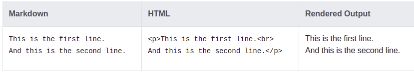
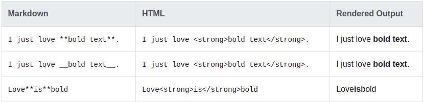
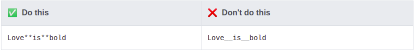
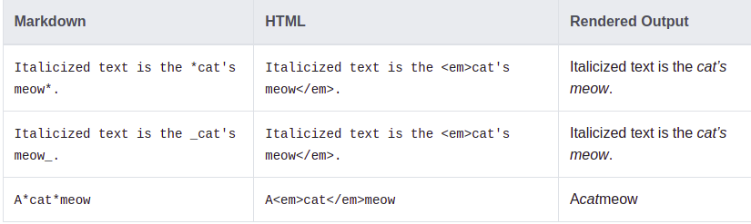
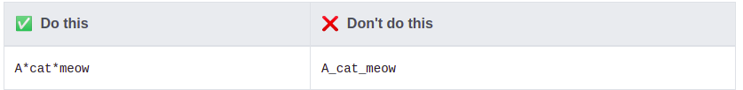
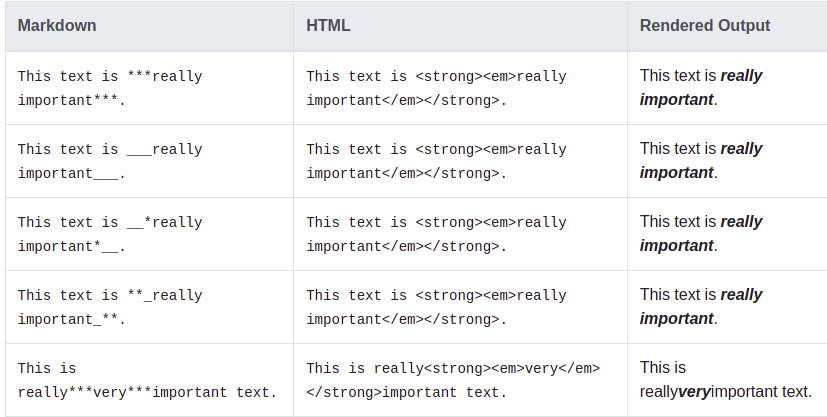
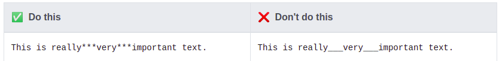

# styling Text in Markdown

You can indicate emphasis with bold, italic, or strikethrough text in comment fields and .md files.

## Paragraph

* To create paragraphs, use a blank line to separate one or more lines of text.

#### Paragraph Best Practices

* Unless the paragraph is in a list, don’t indent paragraphs with spaces or tabs.

## Line Breaks

* To create a line break (< br>), end a line with two or more spaces, and then type return.

## Bold

* To bold text, add two asterisks or underscores before and after a word or phrase.
To bold the middle of a word for emphasis, add two asterisks without spaces around the letters.

#### Bold Best Practices

* Markdown applications don’t agree on how to handle underscores in the middle of a word. 
For compatibility, use asterisks to bold the middle of a word for emphasis.

## Italic

* To italicize text, add one asterisk or underscore before and after a word or phrase.
To italicize the middle of a word for emphasis, add one asterisk without spaces around the letters.

  
#### Italic Best Practices

* Markdown applications don’t agree on how to handle underscores in the middle of a word. For compatibility, use asterisks to italicize the middle of a word for emphasis.
  
  
## Bold and Italic

* To emphasize text with bold and italics at the same time, add three asterisks or underscores before and after a word or phrase. 
To bold and italicize the middle of a word for emphasis, add three asterisks without spaces around the letters.
  
  
#### Bold and Italic Best Practices

* Markdown applications don’t agree on how to handle underscores in the middle of a word. 
  For compatibility, use asterisks to bold and italicize the middle of a word for emphasis.
  

##TODO: From https://www.markdownguide.org/cheat-sheet/#basic-syntax & from https://www.markdownguide.org/basic-syntax/#blockquotes-1
## Blockquotes

# References
1. [www.markdownguide.org](https://www.markdownguide.org/basic-syntax/)
1. [docs.github.com](https://docs.github.com/en/github/writing-on-github/getting-started-with-writing-and-formatting-on-github/basic-writing-and-formatting-syntax#styling-text)